# Activité Pratique : Injection de Dépendances en Java avec Spring

Ce dépôt contient la solution de l'activité pratique portant sur l'injection de dépendances en Java en utilisant le framework Spring. Cette activité est inspirée de la dernière séance de cours et des vidéos fournies comme ressources.Ce TP fait partie du cours de Java JEE dirigé par Mr YOUSSFI Mohamed.

## Objectif
L'objectif de cette activité est de mettre en place une application Java qui applique les concepts de l'injection de dépendances avec trois approches différentes :
1. **Instanciation statique**
2. **Instanciation dynamique**
3. **Utilisation du framework Spring** (version XML et annotations)

## Structure du Projet
Le projet est organisé en plusieurs classes suivant les principes du couplage faible :

### 1. Interface `IDao`
- Contient une méthode `getData()`.
- Sert de base pour une implémentation de la couche d'accès aux données.

### 2. Implémentation de `IDao`
- La classe `DaoImpl` implémente `IDao` et renvoie des données factices.

### 3. Interface `IMetier`
- Contient une méthode `calcul()`.
- Sert de base pour la logique métier.

### 4. Implémentation de `IMetier`
- La classe `MetierImpl` implémente `IMetier` en utilisant une instance de `IDao`.
- L'injection de dépendances se fait selon les trois approches :
  - **Instanciation statique** : La dépendance est créée dans la classe elle-même.
  - **Instanciation dynamique** : La dépendance est fournie via un fichier de configuration.
  - **Spring** : Injection via XML et annotations.

## Utilisation de Spring
Deux méthodes d'utilisation du framework Spring sont présentées :
1. **Configuration XML** : 
   - Un fichier `config.xml` définit les beans et les injections de dépendances.
2. **Annotations** : 
   - Utilisation de `@Component`, `@Autowired`, et `@Service` pour définir et injecter les dépendances dynamiquement.

 ## Captures d'écran

| Par instanciation statique | Par instanciation dynamique | Framework Spring- Version XML | Framework Spring- Version ANNOTATIONS |
|---|---|---|---|
| 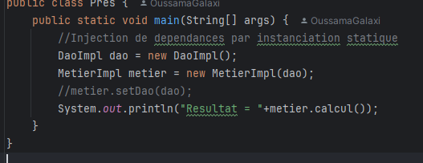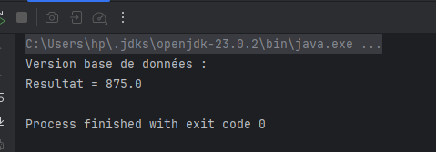 | 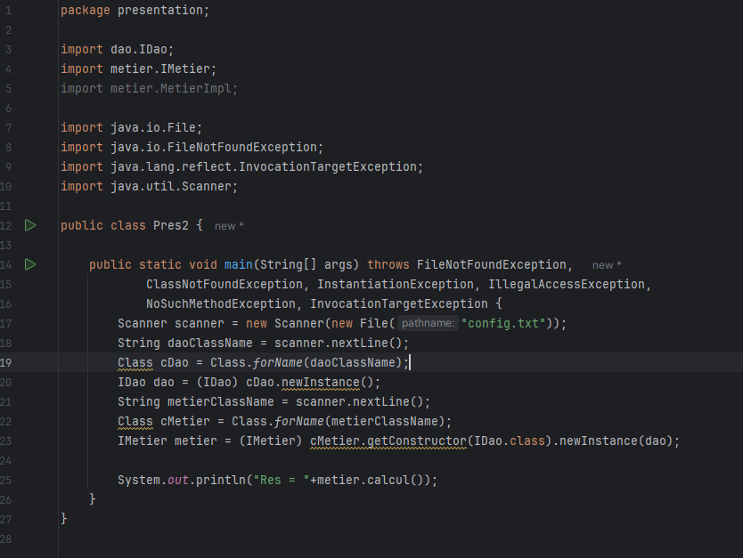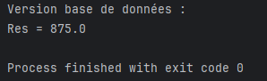 | 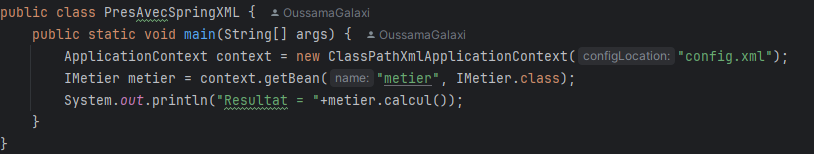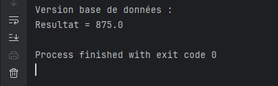 | 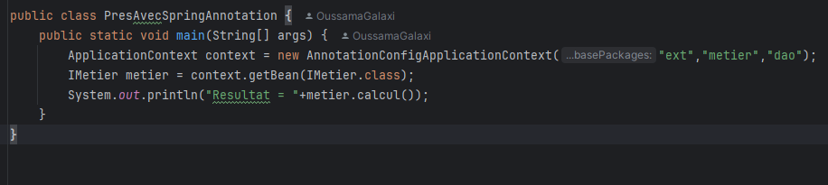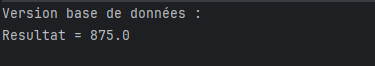 |

| xml-configuration | txt-config | Implementation Extension |
|---|---|---|
| 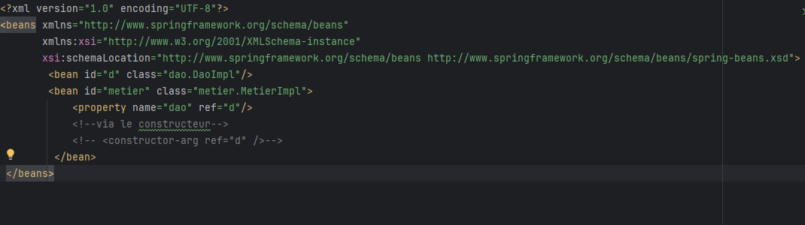 | 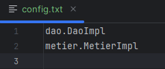 | 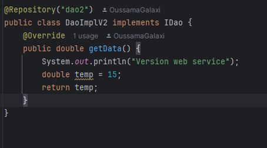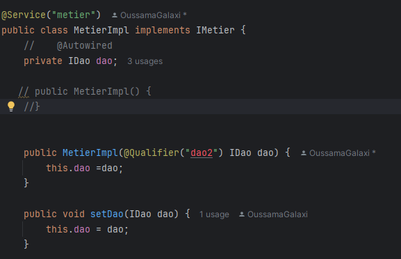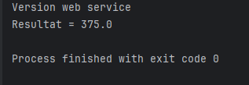 |


## Instructions d'Exécution
1. **Cloner le dépôt** :
   ```bash
   git clone https://github.com/ouss-issib/java-jee-dependency-injection
   
2. Naviguer dans le répertoire du dépôt :
   ```bash
   cd java-jee-dependency-injection

3. Compiler et exécuter les fichiers Java :
   ```bash
    mvn clean install
    mvn exec:java -Dexec.mainClass="ma.enset.Main"
